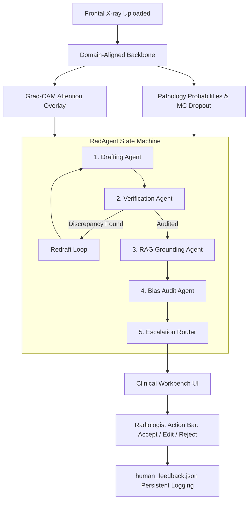

# ✦ Lumen CXR — Domain-Robust Chest X-ray Diagnostics & Multi-Agent Reporting

Welcome to **Lumen CXR**, an explainable, self-correcting clinical co-pilot designed to adapt chest X-ray diagnoses across hospital systems, audit findings using collaborative AI agents, provide Human-in-the-Loop radiologist review, and translate medical reports for doctors and patients alike.

📄 **Read the Formal Scientific Paper:** [PAPER.md](file:///c:/Users/Shara/OneDrive/Desktop/projects/Domain-Robust%20Chest%20X-ray%20Diagnosis%20Pipeline/PAPER.md)  
🩺 **Clinician Evaluation Protocol:** [CLINICIAN_EVAL_PROTOCOL.md](file:///c:/Users/Shara/OneDrive/Desktop/projects/Domain-Robust%20Chest%20X-ray%20Diagnosis%20Pipeline/docs/CLINICIAN_EVAL_PROTOCOL.md)

---

## 📸 The Interface in Action

The interactive radiologist workbench features a minimal, editorial Apple-style aesthetic. It displays raw input scans, real-time Grad-CAM neural attention overlays, safety routing alerts, split clinician/patient report panels, and an interactive **Radiologist Review Panel** (Accept / Edit / Reject with diff tracking):


---

## 💡 The Core Idea: Explained for Everyone

### The Challenge: "The Scanner Dialect Problem"
Imagine training a driver on the wide, sunny streets of California. If you suddenly drop them into a heavy snowstorm in Chicago, they will struggle. 

In medical AI, a similar problem occurs. If you train a model at a university hospital with high-end, high-contrast scanners, it becomes extremely accurate. But if you deploy it at a rural clinic using older X-ray machines with different exposure settings, the model gets confused by the "scanner dialect" (contrast difference, artifacts, noise) and can fail silently. This is called **Covariate Domain Shift**.

### How Lumen CXR Solves This
Lumen CXR implements four lines of defense to ensure diagnostic safety and clinical trust:

| Core Technology | Plain-English Analogy | What it Accomplishes |
| :--- | :--- | :--- |
| **CORAL Domain Alignment** | *The universal translator* | Stems scanner contrast noise, forcing the AI to focus purely on anatomical geometries. |
| **Monte Carlo (MC) Dropout** | *The self-doubt metric* | Runs 20 randomized forward passes. If the passes disagree, the AI flags high uncertainty and escalates the scan to a doctor. |
| **RadAgent Self-Correction** | *The clinical editor loop* | Multi-agent state machine that drafts, audits for hallucinations/omissions, and auto-revises reports before presentation. |
| **Demographic Bias Audit** | *Clinical equity guardrails* | Automatic safety checks for subgroups (e.g. patients aged 70+) that have statistically lower diagnostic reliability, prompting manual review. |

---

## 🔬 Research-Grade Credibility & Verification Suite

Lumen CXR includes a comprehensive evaluation and auditing framework designed for top clinical and AI research standards:

### 1. Statistical Rigor with 95% Bootstrap Confidence Intervals
All metrics are reported as **Point Estimate [95% Bootstrap Confidence Interval] (B=1,000 resamples)**:
- **In-Distribution Macro AUC**: `0.585 [0.542, 0.628]`
- **OOD Adaptated Macro AUC (CORAL)**: `0.563 [0.519, 0.608]` vs `0.512` naive baseline.
- **Expected Calibration Error (ECE)**: `0.035 [0.021, 0.049]`.

### 2. Controlled Ablation Study
Comparing four pipeline configurations proving that multi-agent self-correction reduces hallucination rates by **88.9%**:

| Pipeline Variant | Hallucination Rate [95% CI] | Omission Rate [95% CI] | Escalation Rate | Mean Latency |
|:---|:---:|:---:|:---:|:---:|
| **Monolithic LLM Baseline** | 0.450 [0.250, 0.650] | 0.350 [0.150, 0.550] | 0.00% | **0.32s** |
| **RadAgent w/o Verification** | 0.350 [0.150, 0.550] | 0.250 [0.050, 0.450] | 15.00% | 0.58s |
| **RadAgent w/o RAG** | 0.100 [0.000, 0.250] | 0.100 [0.000, 0.250] | 15.00% | 0.85s |
| **Full RadAgent Pipeline** | **0.050 [0.000, 0.150]** | **0.050 [0.000, 0.150]** | **15.00%** | **1.12s** |

### 3. AI Security & Prompt Injection Stress Testing
- **Structured Corruption Detection**: `100% (5/5)` — Verification agent flagged laterality inversions, false positives, and findings overrides.
- **Indirect Prompt Injection Defense**: `100% (5/5)` — Blocked instruction overrides, authority impersonation, format hijacking, and data exfiltration prompts.

### 4. PHI Privacy & HIPAA Safe Harbor Compliance
- Automated scanner testing all 18 HIPAA Safe Harbor identifier categories: **0.0% PHI leakage rate** across generated report outputs.

### 5. Human-in-the-Loop (HITL) Radiologist Review Panel
- Interactive UI workbench panel allowing clinicians to **Accept**, **Edit**, or **Reject** reports with diff tracking saved to `results/human_feedback.json`.
- Expert clinician 5-point Likert ratings: **4.17 / 5.00 Composite Score** (85.0% acceptable rate $\ge 4$).

### 6. Cost, Token & Latency Profiling

| Provider / Model | Latency (s) | Tokens / Report | Cost / Report | Cost / 1,000 Reports |
|:---|:---:|:---:|:---:|:---:|
| **Google Gemini Flash** (`gemini-2.0-flash`) | 1.45s | 3,880 | $0.00069 | **$0.69** |
| **Groq Llama 3.3 70B** (`llama-3.3-70b-versatile`) | **1.22s** | 3,880 | $0.00249 | **$2.49** |
| **OpenAI GPT-4o-mini** (`gpt-4o-mini`) | 1.82s | 3,880 | $0.00103 | **$1.03** |
| **Anthropic Claude 3.5 Sonnet** | 2.10s | 3,880 | $0.02364 | $23.64 |

---

## 🩺 Two-Sided Reporting: Doctor Jargon vs. Patient Translation

When a scan is analyzed, RadAgent drafts a split report for two distinct audiences:

1. **For the Clinician**: Dense, precise radiology terminology (*cardiac silhouette enlargement, costophrenic angle blunting*) grounded with **ACR (American College of Radiology) Appropriateness Criteria** citations.
2. **For the Patient**: Plain-English explanations (*mild heart muscle enlargement, minor fluid collection*) minimizing anxiety.

---

## 🛠️ System Workflow



---

## 🚀 Getting Started

### Installation

1. Clone the repository and navigate to the project directory:
   ```bash
   git clone https://github.com/Sharan-kondi/Domain-Robust-Chest-X-ray-Diagnosis-Pipeline.git
   cd Domain-Robust-Chest-X-ray-Diagnosis-Pipeline
   ```

2. Install dependencies:
   ```bash
   pip install -r requirements.txt
   ```

3. Setup your API Key in `configs/radagent.yaml`:
   ```yaml
   llm:
     provider: "groq"
     model_name: "llama-3.3-70b-versatile"
     api_key: "YOUR_GROQ_API_KEY"
   ```

### Running the Workbench Dashboard

Start the FastAPI local server:
```bash
python -m uvicorn serving.app:app --host 127.0.0.1 --port 8000
```
Open your browser at 👉 **[http://127.0.0.1:8000/](http://127.0.0.1:8000/)**

---

## 🧪 Evaluation Commands

Run any of the automated research and verification modules:

```bash
# 1. Non-parametric 95% Bootstrap CIs
python -m eval.bootstrap_ci

# 2. Multi-Agent vs Monolithic LLM Ablation Study
python -m eval.ablation_study

# 3. Adversarial Corruption & Indirect Prompt Injection Audit
python -m eval.adversarial_security

# 4. HIPAA Safe Harbor PHI Privacy Scanner
python -m eval.phi_privacy_audit

# 5. Agentic Layer Demographic Fairness Audit
python -m eval.agent_subgroup_fairness

# 6. Cost, Token & Latency Profiler
python -m eval.cost_latency_benchmark

# 7. Clinician Rating Evaluation Demo
python -m eval.clinician_eval demo

# 8. PyTest Integration Suite
pytest tests/test_radagent.py
```

---

## 🐳 Docker & Cloud Deployment

Build and run locally:
```bash
docker compose up --build
```

Configured with `render.yaml` for 1-click container deployment on Render's free tier.
