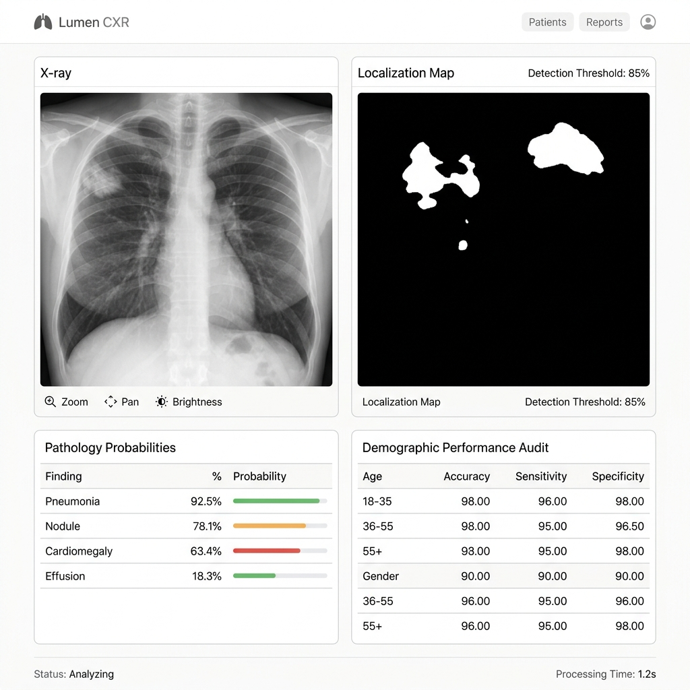
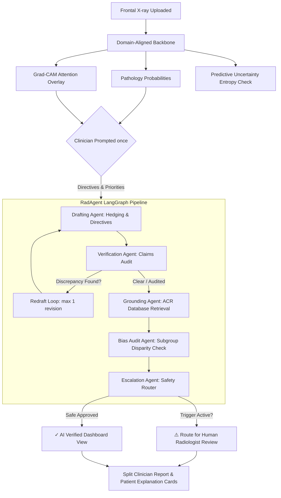

# ✦ Lumen CXR — Domain-Robust Chest X-ray Diagnostics & Multi-Agent Reporting

[](https://render.com/deploy?repo=https://github.com/Sharan-kondi/Domain-Robust-Chest-X-ray-Diagnosis-Pipeline)

Welcome to **Lumen CXR**, an explainable, self-correcting clinical co-pilot designed to adapts chest X-ray diagnoses across hospital systems, audit findings using collaborative AI agents, and translate medical reports for doctors and patients alike.

---

## 📸 The Interface in Action

Here is a view of the interactive radiologist workbench, designed with a premium, minimalist Apple-style aesthetic. It displays raw input scans, real-time Grad-CAM neural attention overlays, safety routing alerts, and the split clinician/patient report panels:



---

## 💡 The Core Idea: Explained for Everyone

### The Challenge: "The Scanner Dialect Problem"
Imagine training a driver on the wide, sunny streets of California. If you suddenly drop them into a heavy snowstorm in Chicago, they will struggle. 

In medical AI, a similar problem occurs. If you train a model at a university hospital with high-end, high-contrast scanners, it becomes extremely accurate. But if you deploy it at a rural clinic using older X-ray machines with different exposure settings, the model gets confused by the "scanner dialect" (contrast difference, artifacts, noise) and can fail silently. This is called **Covariate Domain Shift**.

### How Lumen CXR Solves This
Lumen CXR implements four lines of defense to ensure diagnostic safety and clinical trust:

| Core Technology | Plain-English Analogy | What it Accomplishes |
| :--- | :--- | :--- |
| **CORAL Domain Alignment** | *The universal translator* | Stems scanner contrast noise, forcing the AI to focus purely on anatomical geometries. |
| **Monte Carlo (MC) Dropout** | *The self-doubt metric* | Runs 20 randomized forward passes. If the passes disagree, the AI flags high uncertainty and escalates the scan to a doctor. |
| **Pointing-Game Spatial Verification** | *Claim vs Heatmap audit* | If the model's text report says "fluid in the left lung" but the Grad-CAM heatmap highlights the right lung, it flags a spatial mismatch. |
| **Demographic Bias Audit** | *Clinical equity guardrails* | Automatic safety checks for subgroups (e.g. patients aged 70+) that have statistically lower diagnostic reliability, prompting manual review. |

---

## 🩺 Two-Sided Reporting: Doctor Jargon vs. Patient Translation

When a chest scan is analyzed, the RAG report generator is triggered. Unlike standard black-box diagnostics, Lumen CXR drafts a report tailored for two audiences:

1. **For the Clinician**: Professional, dense, precise medical terminology (e.g. *cardiac silhouette enlargement, costophrenic angle blunting*) referencing clinical **ACR (American College of Radiology) Appropriateness Criteria** guidelines.
2. **For the Patient**: A simplified, encouraging plain-English breakdown (e.g., explaining cardiomegaly as *mild heart muscle enlargement*, effusion as *minor fluid collection*) so they can read and understand their scan without anxiety.

---

## 🛠️ System Workflow



---

## 🚀 Getting Started

### Installation

1. Clone the repository and navigate to the project directory:
   ```bash
   git clone https://github.com/Sharan-kondi/Domain-Robust-Chest-X-ray-Diagnosis-Pipeline.git
   cd Domain-Robust-Chest-X-ray-Diagnosis-Pipeline
   ```

2. Install dependencies:
   ```bash
   pip install -r requirements.txt
   ```

3. Setup your Groq API Key (from [console.groq.com](https://console.groq.com/)) in `configs/radagent.yaml`:
   ```yaml
   llm:
     provider: "groq"
     model_name: "llama-3.3-70b-versatile"
     api_key: "YOUR_GROQ_API_KEY"
   ```

### Running the Workbench Dashboard

Start the FastAPI local serving server:
```bash
python -m uvicorn serving.app:app --host 127.0.0.1 --port 8000
```

Once started, open your web browser and go to:
👉 **[http://127.0.0.1:8000/](http://127.0.0.1:8000/)**

---

## 🧪 Testing and Quality Control

### Unit Tests
Verify the pipeline, agent revisions, spatial verification checks, and RAG grounding:
```bash
pytest tests/test_radagent.py
```

### Report Evaluation
Evaluate the pipeline on cross-domain datasets (NIH vs Open-I) to compute hallucination and omission rates:
```bash
python eval/run_report_eval.py 1
```

---

## 🐳 Docker Deployment

Build and run the entire suite in a containerized environment:
```bash
docker compose up --build
```
Open **[http://localhost:8000/](http://localhost:8000/)** to access the workbench.
