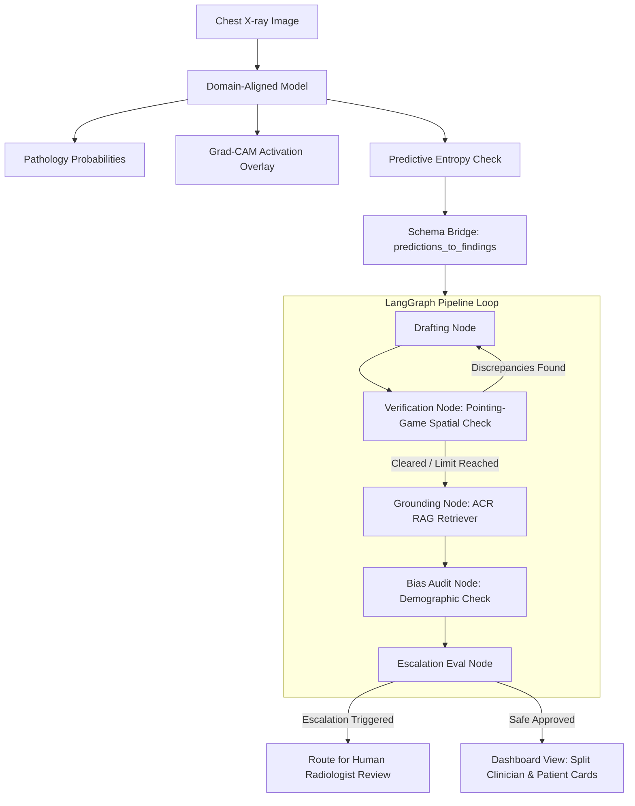

# Lumen CXR — Domain-Robust Chest X-ray Diagnostics & Multi-Agent Reporting

Lumen CXR is an explainable deep learning pipeline and editorial diagnostic dashboard designed to recognize chest pathologies across diverse hospital systems. By aligning covariance representations, estimating predictive uncertainty, mapping neural attention, and deploying a self-correcting multi-agent clinical co-pilot, it overcomes scanner-specific domain shifts.

---

## Key Features

1. **Domain Generalization (CORAL)**: Uses **Correlation Alignment (CORAL)** to minimize covariate shifts between scanner vendors (GE, Siemens, Philips) and hospital sites.
2. **Predictive Uncertainty (MC Dropout)**: Computes predictive entropy across 20 Monte Carlo (MC) Dropout passes to automatically route high-uncertainty scans to human review.
3. **Multi-Agent Reporting (RadAgent)**: A self-correcting **LangGraph StateGraph** pipeline featuring:
   - **Drafting Agent**: Generates clinical radiology reports with confidence-aware hedging.
   - **Verification Agent**: Performs pointing-game spatial audits matching report claim laterality against Grad-CAM peak quadrants, correcting hallucinations and omissions.
   - **Grounding Agent**: Dynamically retrieves American College of Radiology (ACR) Appropriateness Criteria recommendations.
   - **Bias Audit Agent**: Audits patient demographic parameters (Age, Gender) and overrides auto-approval for vulnerable subgroups (e.g., patients aged 70+).
   - **Escalation Agent**: Multi-factor clinical safety router managing uncertainty, unresolved report discrepancies, and RAG guideline failures.
4. **Real-time Drift Detection**: Enhanced pixel-level statistical checks providing instant scanner covariate shift logs upon image upload.
5. **Interactive RAG Modal**: Prompts the clinician once on report generation to configure custom clinical directives and communication priorities.
6. **Split Clinician/Patient Reports**: Instantly generates and renders both a clinical report (Findings & Impressions) for radiologists, and a simplified patient-friendly plain-English card.
7. **Groq API Support**: Native wrapping of Groq's high-speed completion API (running on `llama-3.3-70b-versatile`) to achieve sub-second report generation speeds completely free of daily limits.

---

## System Architecture



---

## Getting Started

### Prerequisites

* Python 3.10+
* PyTorch & Torchvision
* FastAPI & Uvicorn

### Installation

1. Clone the repository and navigate to the project directory:
   ```bash
   git clone https://github.com/Sharan-kondi/Domain-Robust-Chest-X-ray-Diagnosis-Pipeline.git
   cd Domain-Robust-Chest-X-ray-Diagnosis-Pipeline
   ```

2. Install dependencies:
   ```bash
   pip install -r requirements.txt
   ```

3. Configure your API key in `configs/radagent.yaml`:
   ```yaml
   llm:
     provider: "groq"
     model_name: "llama-3.3-70b-versatile"
     api_key: "gsk_YOUR_GROQ_API_KEY"
   ```

### Running the Application

Start the local FastAPI server and diagnostic workspace:
```bash
python -m uvicorn serving.app:app --host 127.0.0.1 --port 8000
```

Once started, open your browser and navigate to:
👉 **[http://127.0.0.1:8000/](http://127.0.0.1:8000/)**

---

## Verification & Testing

Verify system integrity by executing the unit test suite:
```bash
pytest tests/test_radagent.py
```

Run report quality validation metrics on sample checkpoints:
```bash
python eval/run_report_eval.py 1
```

---

## Containerized Deployment (Docker)

To build and run the application containerized:

```bash
docker compose up --build
```

The web service will be hosted on port `8000`.
