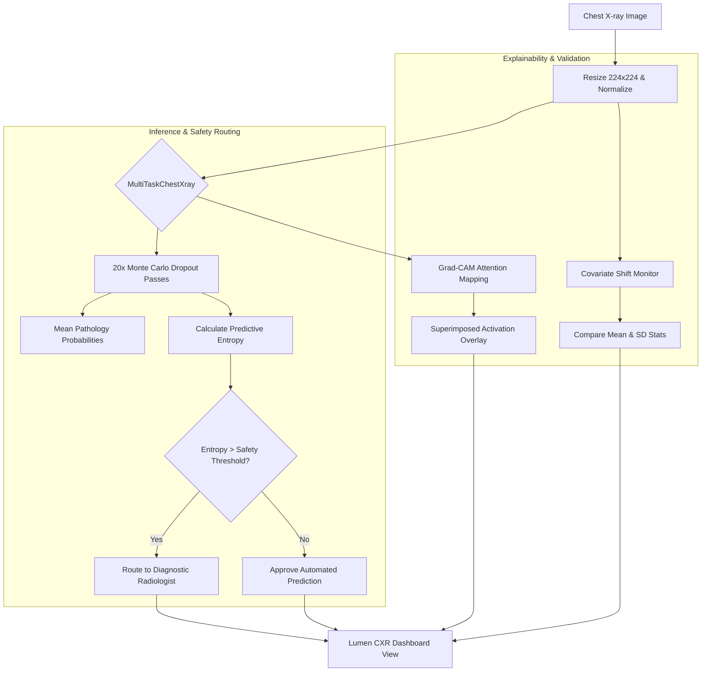

# Lumen CXR — Domain-Robust Chest X-ray Diagnostics

Lumen CXR is an explainable deep learning pipeline and editorial diagnostic dashboard designed to recognize chest pathologies across diverse hospital systems. By aligning covariance representations, estimating predictive uncertainty, and mapping neural attention, it overcomes scanner-specific domain shifts.


---

## Key Features

1. **Domain Generalization**: Uses **Correlation Alignment (CORAL)** to minimize covariate shifts between scanner vendors (GE, Siemens, Philips) and hospital sites.
2. **Predictive Uncertainty**: Computes predictive entropy across 20 Monte Carlo (MC) Dropout passes to route high-uncertainty scans to a radiologist.
3. **Explainability**: Generates Grad-CAM activation heatmaps superimposed on chest X-rays to verify neural attention maps.
4. **Subgroup Performance Audits**: Monitors diagnostic performance across demographic splits (gender, age bracket) to ensure equity.
5. **Real-time Drift Detection**: Continuously monitors incoming image statistics to flag covariate distribution drift.

---

## System Architecture

```mermaid
flowchain
    direction LR
```



---

## Getting Started

### Prerequisites

* Python 3.10+
* PyTorch & Torchvision
* FastAPI & Uvicorn

### Installation

1. Clone the repository and navigate to the project directory:
   ```bash
   git clone https://github.com/your-profile/Domain-Robust-Chest-X-ray-Diagnosis-Pipeline.git
   cd Domain-Robust-Chest-X-ray-Diagnosis-Pipeline
   ```

2. Install dependencies:
   ```bash
   pip install -r requirements.txt
   ```

### Running the Application

Start the local FastAPI server and diagnostic workspace:
```bash
python -m uvicorn serving.app:app --host 127.0.0.1 --port 8000
```

Once started, open your browser and navigate to:
👉 **[http://127.0.0.1:8000/](http://127.0.0.1:8000/)**

---

## Containerized Deployment (Docker)

To build and run the application containerized:

```bash
docker compose up --build
```

The web service will be hosted on port `8000`.

---

## License

This project is licensed under the MIT License - see the LICENSE file for details.
